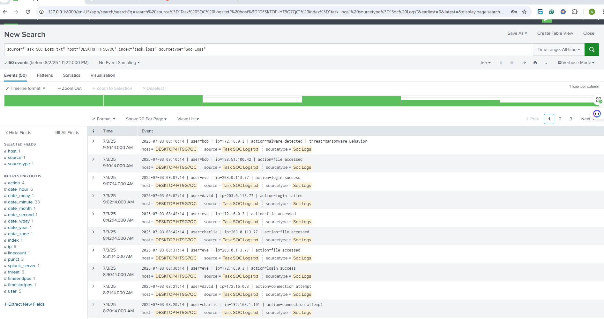
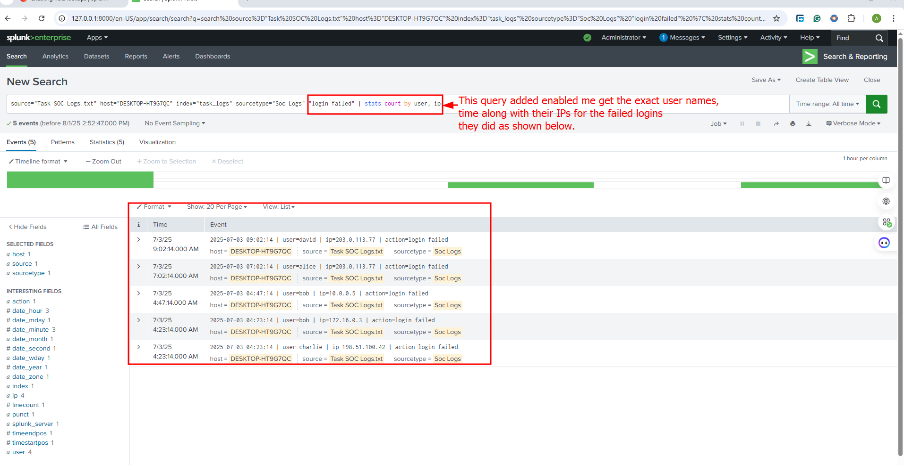
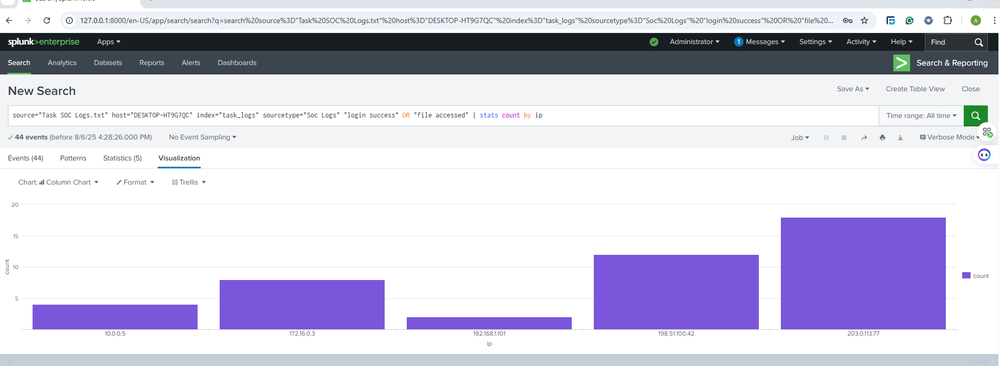
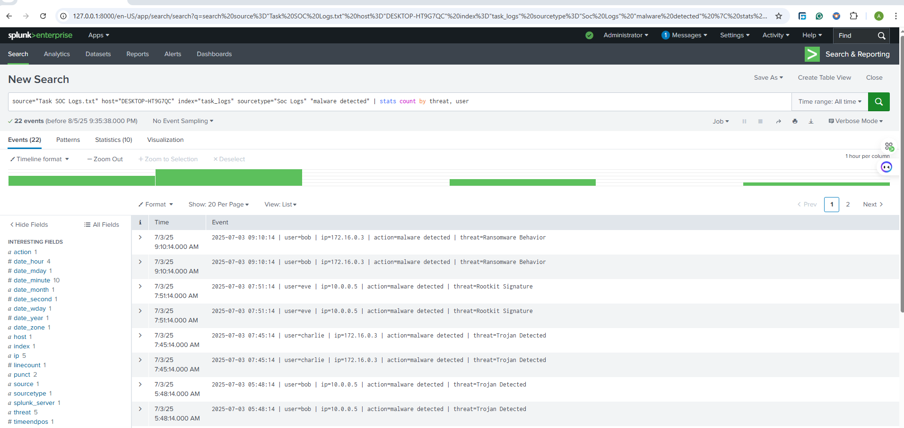

# 🛡️ Task 2 – Security Alert Monitoring & Incident Response

## 📌 Overview
This project was completed as part of my **Cybersecurity Internship with Future Interns**.  
The goal was to simulate a **Security Operations Center (SOC)** environment by monitoring security alerts, identifying suspicious activities, and drafting an **incident response report**.

Target Environment: **Splunk (Free Trial)** with simulated log data.

---

## 🎯 Objectives
- Monitor and analyze security alerts in real time
- Identify patterns and suspicious activities
- Classify incidents by severity level
- Document findings in an incident response report with remediation steps

---

## 🛠 Tools Used
- **Splunk (Free Trial)** – SIEM platform for log monitoring & analysis
- **Sample Log Files** – Simulated system, network, and authentication events
- **Google Docs / Word** – For report documentation

---

## 🔍 Alerts & Incidents Identified
1. **Repeated Failed Login Attempts** – Brute force attempt from suspicious IP
2. **Login from Unusual Geo-Location** – Triggered geo-alert rule
3. **Malware Detection Alert** – Endpoint flagged malicious activity

---

## 📑 Incident Response Summary
| Incident ID | Type                         | Severity | Action Taken                           |
|-------------|------------------------------|----------|-----------------------------------------|
| INC-001     | Failed Login Brute Force     | High     | Escalated – IP blocked via firewall     |
| INC-002     | Geo-location Anomaly         | Medium   | Verified – Account owner contacted      |
| INC-003     | Malware Alert                 | High     | Quarantined – Endpoint isolated         |

---

## 📂 Deliverables
- **Incident Response Report (PDF)**  
  Includes alert details, impact assessment, and recommendations.
- **Splunk Dashboard Screenshot** showing live alert monitoring
- **Alert Classification Log** (CSV/Spreadsheet)

---

## 📖 How to Reproduce
1. **Set up Splunk Free Trial**:
   - Sign up at [Splunk.com](https://www.splunk.com)
   - Install and run Splunk locally or use the cloud trial
2. **Upload the Sample Log File**:
   - In Splunk, go to `Add Data` → Upload the provided log file
3. **Run Searches**:
   - Failed logins:  
     ```spl
     index="main" "Failed login"
     ```
   - Geo-location anomalies:  
     ```spl
     index="main" "login" NOT src_ip="trusted_range"
     ```
   - Malware alerts:  
     ```spl
     index="main" "malware"
     ```
4. **Classify Alerts** and create an incident response report.

---

## 📸 Screenshots
| Description                    | Screenshot |
|--------------------------------|------------|
| Splunk Dashboard Overview      |  |
| Failed Login Search Result     |  |
| Geo-Alert Detection            |  |
| Malware Detection Alert        |  |

---

## 📌 Skills Gained
- SOC Operations Fundamentals
- SIEM Log Analysis
- Incident Classification & Escalation
- Security Documentation & Reporting

---

## 📜 License
This project is for **educational purposes only**.  
Testing was conducted using simulated logs in a controlled lab environment.

---

**Author:** [ATHANASIUS J.K GADOSEY]  
**Internship:** Future Interns – Cybersecurity Track
